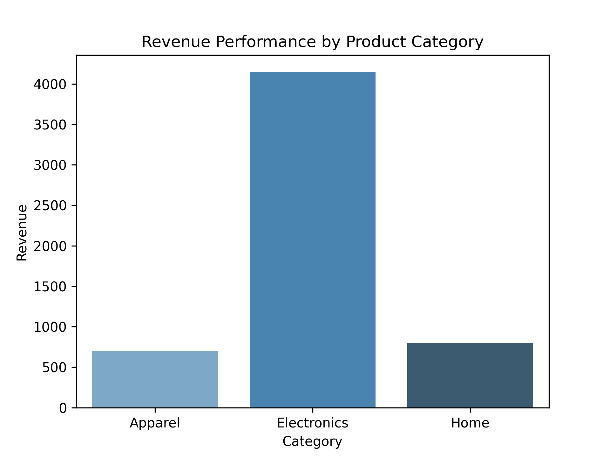

# E-Commerce Sales Performance & Warehouse Diagnostics Pipeline

## Project Overview
This portfolio project demonstrates an end-to-end data analytics workflow spanning data cleaning, relational extraction, and interactive visual business intelligence. The goal is to analyze product profitability and diagnose fulfillment bottlenecks.

## Technologies Used
- **Python (Pandas & Seaborn):** Initial programmatic data cleaning and exploratory analytics.
- **SQL:** Multi-table structural left joins and contextual calculation tracking.
- **Power BI:** Dynamic data modeling and data-pacing executive dashboards.

## Project Deliverables

### 1. Exploratory Analysis Output (Python)
Programmatic data exploration successfully isolated missing revenue flags and plotted baseline trends.

### 2. Analytical Dashboard Presentation (Power BI)
An executive-level snapshot tracking regional performance and delivery pacing schedules.

## Core Analytical Discoveries
- Programmatic left-join configurations retained active unshipped backlogs, protecting overall core portfolio accounting tracking paths.
- Implementing dynamic data charts resolved regional reporting fragmentation across executive reviews.
